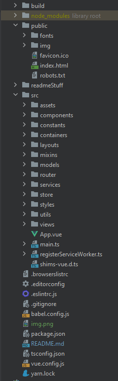
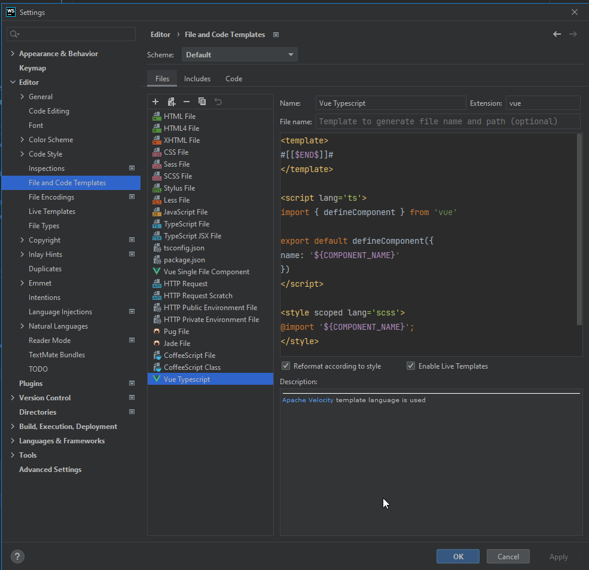
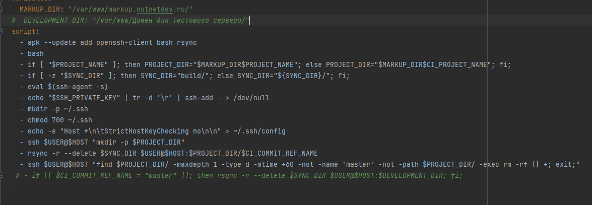
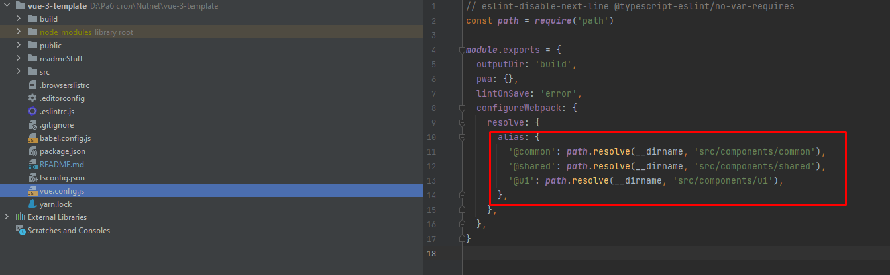
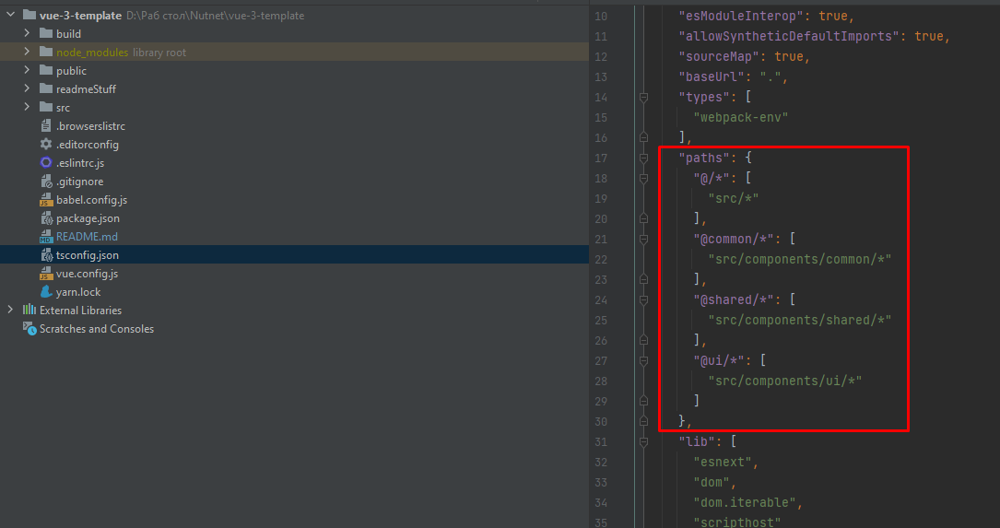
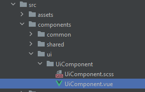

# vityaz-aero-pwa
###### (На основе шаблона [vue-3-template](https://gitlab.com/nutnet/vue-3-template))

## Пособие по работе с шаблоном (_для самых маленьких_)

---
## Оглавление
* [Развертка проекта](#project_init)
* [Основные команды](#main_commands)
* [Структура проекта](#project_structure)
* [TS шаблон для Webstorm / Phpstorm](#ts_webstorm_template)
* [Важно](#important)
* [Стэк](#stack)
---

## Развертка проекта <a name="project_init" id="project_init"></a>

#### При сборке использовались следующие версии программ:
* Node 12.19.0 (если на других версиях не работает, можно сменить версию через [nvm](https://github.com/nvm-sh/nvm#verify-installation))
* Yarn 1.22.5

---

## Основные команды <a name="main_commands" id="main_commands"></a>

### Установка пакетов
```
yarn install
```

### Запуск дэв-сервера
```
yarn start
```

### Сборка
```
yarn build
```

### Запуск линтера (автоматом запускается при коммите)
```
yarn lint
```

---

## Структура проекта <a name="project_structure" id="project_structure"></a>



* __build__: Собранный проект
* __public__: Тут лежат файлы, которые нужны непосредственно в html шаблоне. Шрифты хранить здесь же.
* __readmeStuff__: скрины для этого README


* __src__: Основная папка с проектом
* * __assets__: Папка для файлов не проектного типа (фото, видео, аудио)
* * __components__: Папка для компонентов
* * __constants__: Папка для констант
* * __containers__: Хранит в себе контейнеры (Контейнер - обертка для компонентов, которая содержит в себе вызови к апи, делая при этом сам компонент чище)
* * __layouts__: Лейауты - это шаблоны для страниц. В лейауты вносят те компоненты, которые есть на страницы всегда, независимо от других элементов. Например header и  footer
* * __mixins__: Хранит в себе куски кода, которые повторяются и задействуют Vue
* * __models__: Здесь хранятся глобальные типы (aka модели) тайпскрипта (интерфейсы, типы)
* * __router__: Содержит файл с роутами на разные страницы (Совет: если роутов много - стоит разбивать на разные файлы)
* * __services__: Содержит файлы с функциями, обращающимися к апи, local/session storage
* * __store__: Папка с глобальным хранилищем. Внутри себя содержит папку modules в которой и нужно создавать индивидуальные подхранилища
* * __styles__: Папка для глобальных стилей проекта
* * __utils__: Содрежит файлы с обычными js функциями (В некоторых проектах названа Helpers или functions)
* * __views__: Здесь лежат основные страницы сайта (именно эти компоненты должны идти в роутер)


* ___App.vue___ - Родительский компонент для всего приложения
* ___Main.ts___ - Инициализирующий файл
* ___registerServiceWorker___ - файл для настройки pwa (+ pwa настраивается в vue.config.js)

---

## TS шаблон для Webstorm / Phpstorm <a name="ts_webstorm_template" id="ts_webstorm_template"></a>

* в intelij есть шаблон для обычного вью, но вью на ts требуют немного другой настройки. Рекомендую добавить себе этот шаблон для удобства
```
<template>
#[[$END$]]#
</template>

<script lang='ts'>
import { defineComponent } from 'vue'

export default defineComponent({
name: '${COMPONENT_NAME}'
})
</script>

<style scoped lang='scss'>
@import '${COMPONENT_NAME}';
</style>
```
* И настройте как на скрине (шаблон добавляется через +)
  

---

## Важно <a name="important" id="important"></a>

* Пакеты ставить через yarn
* Вью императивно застявляет использовать default экспорт вместо именованного. (К ts файлам не относится). Поэтому компоненты при импорте стоит называть по названию их файла. Кто будет алиасить имена - пусть сам потом и расхлебывает
* Линтер уже настроен так, чтобы держать код структурированным, но не заколёбевать по каждой мелочи (если что-то хочется изменить, лучше посоветоваться с командой)
* Билд будет собираться на сервере гитлаба (т.е. делать билд перед коммитом не надо).
  Если есть отдельный поддомен для сайта - добавьте его в файл .gitlab-ci.yml (там где написано "Домен для тестового сервера")
  и раскомментируйте зеленые строки (удалить #) - скрин ниже.
  P.S. на тестовый сайт билд будет делаться только при заливке в ветку master
  


* В проекте настроены алиасы для некоторых путей. Если нужно добавить еще - делайте по аналогии со скринами ниже
  
  

>Пояснение по алиасам. Алиас позволяет не прописывать полный путь до чего-либо.
> Например на скрине ниже до папки UiComponent можно добраться через полный путь
> (с изначальным алисаом @) = "@/components/ui/UiComponent"
> Либо прописать короткий алиас "@ui/UiComponent"
>
> 
>
> ___Скорее всего, из-за авто-импорта вообще не придется париться с ручным прописыванием путей, но знать про алиасы все равно полезно___
---

## Стэк <a name="stack" id="stack"></a>

- [x] Vue (Cli)
- [x] Vue Router
- [x] Vuex
- [x] Typescript
- [x] SCSS
- [x] Axios
- [x] Babel
- [x] Eslint

---
